# Cricket-SDLC Framework

## Description
The Cricket-SDLC framework aims to integrate the principles of the Software Development Life Cycle (SDLC) within the context of cricket. This framework provides a structured approach that maps cricket terminology and practices to project management concepts, enhancing teamwork, strategy, and project completion in both fields. By drawing parallels between cricket and software development, this framework offers valuable insights for coaches, players, and project managers, promoting a deeper understanding of the processes involved in both areas.

## Framework Overview
The framework uses various elements of cricket to illustrate the stages and processes of the SDLC. Each aspect of the game mirrors a component of project management, creating an engaging and relatable method for understanding how these concepts can be applied in a team-based environment. 

### Key Components:
- **Players as Employees**: Each player on the cricket team represents an employee in a project team. Players have defined roles based on their skills and contributions to the game (e.g., batsmen, bowlers, fielders). This analogy helps emphasize the importance of every team member in achieving project goals.
  
- **Ball as a Task/Project**: The cricket ball symbolizes a task or project that the team is working on. Each delivery represents a specific task that needs to be executed successfully, highlighting the need for focus and coordination in project execution.

- **Scoring Runs as Project Completion**: Successfully scoring runs represents the completion of a project. Each run scored contributes to the overall objective of winning the match, illustrating how incremental achievements contribute to the final goal.

- **Cyclical Nature**: The framework emphasizes that cricket projects are ongoing and can cycle through phases repeatedly. After scoring runs (completing a project), teams can analyze their performance, gather feedback, and apply insights to improve strategies in future matches.

## Team Hierarchy and Player Positions
In cricket, each player's role is essential to the team's success. Understanding the hierarchy and the responsibilities of each position can enhance collaboration and efficiency, both on the field and in project management.

| Player Position       | Role in Team                     | SDLC Equivalent                    | Description                                              |
|----------------------|----------------------------------|------------------------------------|----------------------------------------------------------|
| **Captain**          | Team Leader                      | Project Manager                    | Oversees the project, making strategic decisions and ensuring alignment with goals. The captain must exhibit strong leadership qualities, such as vision, communication, and the ability to inspire others. |
| **Vice-Captain**     | Deputy Leader                    | Assistant Project Manager          | Supports the captain in decision-making and fills in when necessary. The vice-captain often acts as a bridge between the captain and the rest of the team, facilitating communication and coordination. |
| **Batsmen**          | Key Contributors                 | Development Team                   | Responsible for scoring runs and executing strategies during the innings. Batsmen must work together to build partnerships, akin to developers collaborating on a feature. They require skills in collaboration, adaptability, and performance under pressure. |
| **Bowlers**          | Risk Management                  | QA and Testing Team                | Focus on minimizing risk while ensuring quality in performance. Bowlers analyze conditions and adapt their strategies, similar to how QA teams test and refine products. They must display critical thinking and problem-solving skills. |
| **Wicketkeeper**     | Safeguard                       | Risk Manager                       | Protects the team's interests and ensures task completion, mirroring the role of risk managers in projects. The wicketkeeper must be vigilant and responsive, ensuring that no opportunity for scoring is missed. |
| **Fielders**         | Support Staff                    | Support Team                       | Ensures efficient ball fielding, facilitating successful task completion. Good fielding can save runs, similar to how support roles can enhance project efficiency. Fielders must work collaboratively and remain alert throughout the game. |
| **All-rounders**     | Versatile Players                | Cross-functional Team Members      | Contributes to both batting and bowling, showcasing versatile skills in project teams. All-rounders can adapt to various situations, enhancing team flexibility. They often take on leadership roles within the team, displaying resilience and a strong work ethic. |

## Key Terms and Their SDLC Equivalents

| Cricket Term          | SDLC Equivalent                | Description                                              |
|----------------------|-------------------------------|----------------------------------------------------------|
| **Toss**             | Project Kickoff               | The initial decision-making event that sets project direction. Winning the toss gives teams the opportunity to choose strategies, similar to establishing project goals. |
| **Innings**          | Development Phase              | The period where the team executes strategies to score runs. Each innings is a defined phase of play, much like the stages of development in a project. |
| **Wicket**           | Critical Task                  | A key moment when a player is dismissed, impacting project success. Losing a wicket can shift the momentum of a game, similar to a critical task failing in a project. |
| **Bowling Strategy** | Project Strategy               | The planned approach for delivering the ball, mirroring project planning. Teams develop bowling strategies based on the opposition's strengths and weaknesses, akin to strategic project planning. |
| **Fielding Positions**| Team Roles                    | Defined roles for players, ensuring every task aspect is covered. Just as each team member has a specific function, roles in a project must be clearly defined to ensure accountability. |
| **Umpire Review**    | Quality Assurance               | Reviewing decisions to ensure they align with rules, similar to QA in SDLC. Umpires ensure fair play, much like QA teams ensure product quality. |
| **Scoring Runs**     | Project Completion             | Successfully achieving the goal of the innings. Each run scored contributes to the overall target, similar to project milestones leading to completion. |
| **Review Sessions**   | Retrospectives                 | Meetings held to analyze performance and strategize for the next innings. Teams reflect on their play to identify areas for improvement, paralleling Agile retrospectives. |
| **Power Play**       | Development Sprint              | A specific phase allowing the batting team to score freely, akin to Agile sprints. During a power play, the rules favor the batting team, similar to focused sprint efforts in project development. |

## Leadership Skills and Their Importance

Leadership is a critical component of both cricket and project management. The success of a cricket team and the effectiveness of a project team often hinge on the strength of their leadership. Here are some essential leadership skills and how they translate between cricket and project management:

### 1. **Vision and Strategy**
- **Cricket**: A captain must have a clear vision for the match and articulate strategies that align with the team’s strengths and the conditions of play. They assess the opposition, the pitch, and the match situation to create a winning strategy.
- **Project Management**: Similarly, a project manager must develop a vision for the project and communicate it effectively to the team. They create strategic plans that guide the project toward its objectives while considering risks and stakeholder expectations.

### 2. **Communication**
- **Cricket**: Effective communication is vital on the field. Captains must convey strategies, motivate players, and make real-time decisions that require clear and concise instructions. Players also need to communicate with each other to execute plays effectively.
- **Project Management**: In project management, strong communication ensures that all team members understand their roles, responsibilities, and the project's progress. It facilitates collaboration and helps mitigate misunderstandings that can derail projects.

### 3. **Motivation and Team Building**
- **Cricket**: A captain plays a pivotal role in motivating the team, fostering a positive environment, and building team cohesion. By recognizing individual contributions and promoting a sense of belonging, the captain enhances team morale.
- **Project Management**: Project managers similarly need to motivate their teams, creating an atmosphere of trust and support. They recognize individual strengths and contributions, ensuring that team members feel valued and engaged.

### 4. **Decision-Making and Problem-Solving**
- **Cricket**: Captains face critical decisions during a match, such as changing bowling strategies or field placements. Effective problem-solving skills allow them to adapt to changing circumstances and make timely decisions.
- **Project Management**: In project management, decision-making is equally crucial. Project managers must analyze data, evaluate risks, and make informed choices that impact project success. Agile methodologies often require quick adaptations based on feedback and changing requirements.

### 5. **Conflict Resolution**
- **Cricket**: Disputes may arise among players during a game, whether about strategies or performance issues. A captain must address conflicts promptly and fairly, maintaining team harmony.
- **Project Management**: Project managers must also navigate conflicts within the team or with stakeholders. They should employ conflict resolution techniques to foster collaboration and ensure the project stays on track.

## Cricket-SDLC Interaction
The Cricket-SDLC framework allows teams to leverage project management principles through cricket strategies, enhancing both performance and teamwork. By understanding the interactions between cricket and project management, teams can foster an environment that encourages communication, collaboration, and continuous improvement.

### Example Scenarios:
1. **Strategy Meetings**: Before each match, teams can hold strategy meetings to discuss their game plan. This mirrors project kickoff meetings, where objectives and roles are clarified.

2. **Innings Analysis**: After each innings, teams can analyze their performance, identifying strengths and weaknesses. This practice aligns with post-sprint reviews in Agile, promoting a culture of learning and adaptation.

3. **Game Adjustments**: During a match, teams must be adaptable. For instance, if a bowler is ineffective, the captain may decide to change the strategy mid-game. This flexibility is crucial in both cricket and project management, where conditions and requirements can change rapidly.

### Mermaid Diagram

```mermaid
graph TD
    A[Cricket-SDLC Framework]
    
    subgraph Project_Kickoff
        direction LR
        A1[Identify Project Goals] --> A2[Assemble Team]
        A2 --> A3[Define Roles & Responsibilities]
        A3 --> A4[Develop Project Plan]
        A4 --> A5[Establish Communication Protocol]
    end

    subgraph Development_Phase
        direction LR
        B1[Player Training] --> B2[Game Strategies]
        B2 --> B3[Practice Matches]
        B3 --> B4[Review Performance]
        B4 --> B5[Adjust Strategies]
        B1 --> B6[Feedback Loop]
        B6 --> B2
    end

    subgraph Sprint_Review
        direction LR
        C1[Conduct Review Meeting] --> C2[Evaluate Team Performance]
        C2 --> C3[Identify Successes & Challenges]
        C3 --> C4[Document Lessons Learned]
    end

    subgraph Project_Completion
        direction LR
        D1[Score Goals] --> D2[Analyze Outcomes]
        D2 --> D3[Project Documentation]
        D3 --> D4[Celebrate Success]
        D4 --> D5[Reflect on Process]
        D5 --> A[Return to Kickoff Phase]
    end

    subgraph Leadership_Roles
        direction LR
        E1[Team Captain] --> E2[Motivate Players]
        E2 --> E3[Lead by Example]
        E3 --> E4[Communicate Vision]
        E1 --> E5[Encourage Teamwork]
        E5 --> E6[Resolve Conflicts]
    end

    A --> Project_Kickoff
    A --> Development_Phase
    A --> Sprint_Review
    A --> Project_Completion
    A --> Leadership_Roles

```

### Explanation of the Diagram:
- **Project Kickoff**: This phase outlines the initial steps required to set project goals, assemble the team, and establish communication protocols.
- **Development Phase**: Represents the ongoing training and strategy development, including practice matches and feedback loops.
- **Sprint Review**: Involves reviewing performance, identifying successes and challenges, and documenting lessons learned.
- **Project Completion**: Focuses on achieving project goals, analyzing outcomes, and celebrating successes, with a return to the kickoff phase for continuous improvement.
- **Leadership Roles**: Highlights the importance of leadership within the team, emphasizing motivation, teamwork, and conflict resolution.
