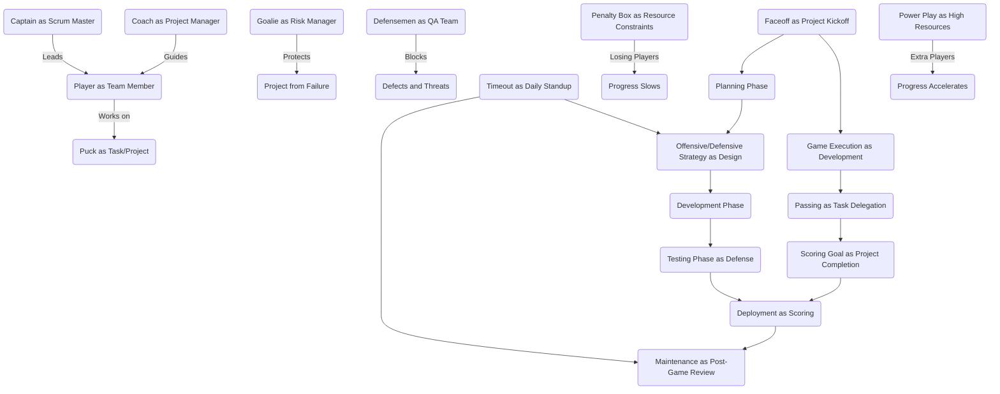

# Hockey and Software Development Life Cycle (SDLC) Framework

## Introduction

This document outlines a framework that parallels the principles of the Software Development Life Cycle (SDLC) with the roles, strategies, and activities in the sport of hockey. The goal is to provide a structured understanding of how team-based sports, particularly hockey, mirror project management and development cycles. By drawing analogies between these two worlds, we aim to create a framework that is useful for both training and educational purposes, enhancing teamwork, strategic thinking, and iterative processes.

## Objective

The primary objective is to create a comprehensive framework that maps hockey terminology and strategies to the SDLC stages. This can serve as a powerful tool for both project managers and sports teams, allowing them to visualize how concepts from one domain can be applied to the other. I'll further elaborate on each mapped term and process, ensuring depth and clarity.

## Hockey-SDLC Mapping: Roles and Concepts

| **Hockey Concept**         | **SDLC Equivalent**            | **Description**                                                                 |
|----------------------------|--------------------------------|---------------------------------------------------------------------------------|
| Players                    | Team Members                   | Each player represents a member of the project team, with specific roles and responsibilities. |
| Coach                      | Project Manager                | The coach serves as the project manager, guiding the team, developing strategies, and making real-time adjustments. |
| Captain                    | Team Leader                    | The captain leads the team on the ice, similar to how a team lead or Scrum Master guides the project team. |
| Puck                       | Task/Project                   | The puck symbolizes the task or project the team is working to advance, requiring collaboration and coordination. |
| Scoring a Goal              | Project Completion             | Scoring a goal represents the successful completion of a task or project milestone. The game continues (project iteration) until the overall objective is reached. |
| Goalie                     | Risk Manager                   | The goalie protects the team from potential risks (i.e., the opposition scoring), much like a risk manager who mitigates project risks. |
| Defensemen                  | Quality Assurance Team         | Defensemen act as the QA team, ensuring the project stays on track by defending against external threats and challenges. |
| Face-off                   | Project Kickoff                | The face-off is akin to the kickoff meeting, where the project begins, and both teams (stakeholders) try to gain control and set the pace. |
| Timeout                    | Daily Stand-up Meeting         | Timeouts are like daily stand-ups, where the team regroups, reassesses progress, and adjusts strategies. |
| Penalty Box                | Resource Constraints / Issues  | A player in the penalty box mirrors team members being unavailable or issues with resource allocation, slowing down project progress. |
| Power Play                 | High-Resource Sprint           | A power play gives the team an advantage in resources (extra players), symbolizing a sprint with increased focus or resources. |
| Defensive Zone Coverage     | Risk Mitigation Strategy       | Players defending the goal area resemble a well-planned risk mitigation strategy to prevent failures (opponents scoring). |
| Offensive Strategy          | Project Plan                   | The team's approach to scoring goals mirrors the project plan, detailing how the team will achieve its objectives. |
| Passing the Puck            | Task Delegation                | Passing the puck between players reflects task delegation and collaboration within the team. |
| Coaching Adjustments        | Retrospective Improvements     | Mid-game adjustments by the coach mirror the lessons learned and process improvements during a sprint retrospective. |
| Player Substitution         | Team Role Adjustment           | Substituting players represents role changes or reassigning tasks based on performance or project needs. |
| Penalty Shot                | High-Risk Task                 | A penalty shot represents a critical, high-stakes task that can significantly impact project success or failure. |

### Expanded Descriptions

#### Players as Team Members
In hockey, every player has a specific role and responsibility on the ice, just as in a project team. Defensemen, forwards, and goalies work together towards a common goal. Similarly, project teams consist of developers, designers, testers, and managers, all working in unison to complete tasks and achieve project objectives.

#### Coach as Project Manager
The coach, who develops strategies, adjusts the game plan, and motivates the team, is equivalent to the project manager. The coach ensures that all players are aligned with the team’s objectives, much like how a project manager ensures that all team members are on the same page.

#### Captain as Team Leader / Scrum Master
The team captain leads the team on the ice, providing guidance and acting as a role model for other players. In an SDLC framework, this role is comparable to the Scrum Master or team lead, responsible for facilitating communication, resolving conflicts, and keeping the team focused on the project goals.

#### Puck as Task or Project
The puck symbolizes the task or project that needs to be completed. Just as players pass the puck to advance it towards the opponent's goal, team members in a project collaborate to move tasks forward towards completion.

#### Goalie as Risk Manager
The goalie’s job is to stop the opponent from scoring, representing risk management in a project. Just like the goalie, a risk manager ensures that potential risks (threats to the project) are identified and mitigated to prevent project failure.

#### Power Play as High-Resource Sprint
A power play in hockey gives the team a numerical advantage (extra player on the ice), similar to a sprint where the project team receives additional resources or focus to tackle critical tasks quickly and efficiently.

#### Penalty Shot as High-Risk Task
A penalty shot represents a critical task in a project that has high stakes. If successfully executed, it can determine the success of the project, much like a penalty shot can decide the outcome of a game.

#### Face-off as Project Kickoff
The face-off is where the game (or project) begins, and both teams vie for control of the puck (project direction). This mirrors the project kickoff meeting, where initial strategies and objectives are discussed, and roles are clarified.

## Cyclical Nature of Hockey and SDLC

Just as hockey is an ongoing, cyclical process of playing games, scoring goals, and reviewing performance, the SDLC follows an iterative approach. After a task (goal) is completed, the project team reviews their performance (retrospective), identifies areas for improvement, and applies those insights to the next iteration or sprint. The constant cycle of playing, reviewing, and improving is core to both hockey and SDLC.

### Phases of the SDLC in Hockey Context

1. **Planning (Face-off / Project Kickoff)**:
   - The face-off in hockey represents the beginning of the project where both teams set their initial strategies and goals. Just like in the SDLC, the project planning phase involves understanding requirements, setting objectives, and preparing for the project ahead.

2. **Design (Offensive / Defensive Strategy)**:
   - Hockey teams design their offensive and defensive plays before the game, which mirrors the design phase in SDLC where project teams create architectural plans and set up workflows to accomplish tasks.

3. **Development (Executing Game Plan / Passing the Puck)**:
   - The team executing its game plan, passing the puck, and working together to score goals is analogous to the development phase where team members work on tasks, collaborate, and deliver features or products.

4. **Testing (Game Execution / Defense Play)**:
   - Just as hockey players execute their defensive strategies to prevent the opponent from scoring, testing in the SDLC ensures that the project works as expected, identifying any defects or areas for improvement.

5. **Deployment (Goal Scoring / Project Completion)**:
   - Scoring a goal reflects successfully deploying a project deliverable. It’s the moment when the team’s hard work pays off, but the project or game continues as the team strives for continuous improvement.

6. **Maintenance (Post-Game Review / Retrospective)**:
   - After each game, teams analyze their performance, identifying areas for improvement for the next game. Similarly, the SDLC includes a maintenance phase where projects are continuously refined and updated based on feedback and issues.

## Practical Applications

The Hockey-SDLC framework offers practical benefits for both fields:

1. **For Sports Teams**: The framework can be used to better understand team dynamics, strategy formation, and continuous improvement by relating them to well-established project management methodologies.

2. **For Project Managers**: Project managers can draw inspiration from hockey’s fast-paced, team-oriented environment to enhance team communication, risk management, and resource allocation.

## Conclusion

By applying SDLC principles to hockey, this framework highlights the parallels between sports and project management, encouraging a deeper understanding of teamwork, strategy, and iterative progress. It offers a fun yet insightful way to visualize how both domains operate and can be improved by borrowing concepts from each other.

