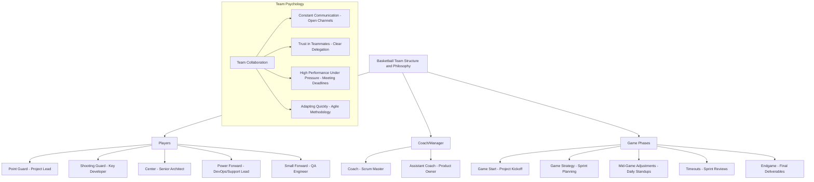

# Basketball & SDLC: A Game-Changing Guide for Tech Teams

## Introduction

Just like a basketball team thrives on coordination, strategy, and adaptability, a successful tech team flourishes through teamwork, agile methods, and continuous improvement. This guide uses basketball’s core principles—methods, philosophy, and psychology—and maps them to the Software Development Life Cycle (SDLC), creating a fun, engaging framework for your tech team to apply to project management and software development.

## Why Basketball?

Basketball, much like SDLC, is a dynamic, fast-paced game that demands teamwork, communication, strategy, and the ability to adapt quickly to changing situations. By breaking down the key elements of basketball and mapping them to SDLC stages, your team can visualize how they can collaborate and perform at their peak levels—just like a championship basketball team.

---

## Basketball Methods Mapped to SDLC

### Offensive Strategies → Task Execution in SDLC
Offense in basketball is about driving towards the goal, and in tech teams, this translates to pushing tasks toward completion. Key strategies include:

- **Passing Drills → Task Delegation**: Just as passing the ball involves trust and clear communication, task delegation in SDLC should be seamless, ensuring the right people are handling the right tasks.
- **Screening Plays → Prioritization of Tasks**: Screens help free up the best shooter, just as prioritization frees up critical resources to tackle important tasks.
- **Fast Break → Fast Iterations**: The fast break is about speed and opportunity. In SDLC, fast iterations during sprints allow teams to stay agile and capitalize on opportunities for quick wins.

### Defensive Strategies → Risk Management & Quality Assurance
Defense ensures that the opposition doesn’t score, just as risk management and quality assurance ensure projects don’t fail:

- **Man-to-Man Defense → Dedicated Role Assignment**: In man-to-man, each player is accountable for an opponent, just like team members in SDLC are responsible for specific tasks or aspects of the project.
- **Zone Defense → Cross-Functional Collaboration**: Zone defense relies on covering space and working as a unit, much like cross-functional teams protecting the project’s quality.
- **Switching Assignments → Agile Adaptation to Risk**: When two defenders switch roles to counter a threat, it mirrors adapting roles in Agile to address emerging risks.

### Team Coordination → Project Management & Scrum
Team coordination is central to basketball, and in SDLC, this aligns with meetings, communication, and project planning:

- **Timeouts → Sprint Reviews & Standups**: A timeout is an opportunity to regroup, discuss the current state of play, and adjust tactics—just like sprint reviews or daily standups in Scrum.
- **Communication → Transparency in Agile**: In basketball, constant communication is vital. In Agile, transparency and open communication are keys to success.
- **Game Plan → Sprint Planning**: A game plan outlines the team’s strategy before the match, just as sprint planning establishes the project’s roadmap and goals for the iteration.

---

## Basketball Philosophy Mapped to SDLC

### Teamwork Over Individualism → Collaboration in Agile
In basketball, teamwork trumps individual talent. The same is true in software development—no matter how skilled someone is, the team’s performance determines the project’s success.

- **Passing > Solo Plays → Collaboration > Individual Work**: The best teams pass the ball effectively, making every player a threat. In Agile, teams must collaborate to deliver high-quality work, avoiding silos or over-reliance on individual contributors.

### Adaptability and Flexibility → Agile Practices
Basketball players constantly adjust to the flow of the game, much like Agile teams adapt to changing project requirements or market conditions.

- **Adjusting to Opponent’s Tactics → Responding to Change**: Successful teams adjust their strategy based on their opponent's strengths and weaknesses. In SDLC, teams must stay flexible, responding to feedback or changes in project scope with agility.

### Continuous Improvement → Sprint Retrospectives
In basketball, teams analyze their previous games to learn and improve for future contests, just like Agile teams use sprint retrospectives.

- **Analyzing Past Games → Retrospectives**: Teams review game footage to identify areas for improvement. In Agile, retrospectives offer a chance for the team to reflect on what went well, what didn’t, and how they can improve for the next sprint.
- **Improving Strategy → Sprint Refinement**: Just as teams refine their tactics, Agile teams refine their processes and strategies for better results in future sprints.

---

## Basketball Psychology Mapped to SDLC

### Mental Toughness → Handling Pressure in Projects
Basketball requires players to stay calm and focused under pressure, which parallels tech teams handling tight deadlines, scope changes, and other challenges.

- **Staying Focused Under Pressure → Managing Tight Deadlines**: Like players sinking game-winning shots under pressure, tech teams must manage high-pressure moments with focus and clarity.
  
### Trust in Teammates → Delegation and Accountability
In basketball, trust between teammates is critical for success. In SDLC, this means trusting your team to execute their tasks, share responsibility, and support one another.

- **Trusting the Team → Delegating Work**: Passing the ball requires trusting that your teammate will make the right play. Similarly, team members must trust each other to handle their responsibilities without micromanagement.

### Handling High-Stakes Moments → Managing Critical Tasks
Basketball is full of high-stakes moments like free throws in the final seconds. Similarly, in SDLC, critical tasks can make or break a project.

- **Performing in High-Stress Situations → Critical Task Management**: Players practice high-pressure scenarios to stay composed during crunch time. Likewise, tech teams must be prepared to handle critical tasks that could determine the project’s outcome.

---

## Implementing This Framework in Your Tech Team

### Action Plan:

1. **Introduction to the Team**: Present the basketball-to-SDLC analogy to the team, explaining how each aspect of the game maps to software development processes.
   
2. **Team Roles and Responsibilities**: Just like a basketball team has point guards, forwards, and centers, assign clear roles to each team member, ensuring everyone knows their part in the SDLC process.

3. **Daily Standups as Timeouts**: Run daily standups like basketball timeouts, using this time to assess progress, address issues, and tweak strategies.

4. **Sprint Planning as a Game Plan**: Approach sprint planning like a basketball game plan—define the strategy, delegate responsibilities, and ensure the whole team is aligned before starting each "game" (sprint).

5. **Sprint Retrospective as Post-Game Analysis**: Use retrospectives to analyze team performance after each sprint, identifying areas for improvement, much like reviewing game footage to refine tactics.

6. **Foster Collaboration**: Encourage team members to "pass the ball"—fostering a collaborative environment where they rely on each other for support and knowledge-sharing.

7. **Emphasize Mental Toughness**: Train the team to handle pressure calmly, especially during critical tasks and tight deadlines.

---

## Conclusion

By merging basketball methods, philosophy, and psychology with SDLC practices, you can create a unique, engaging environment for your tech team. This framework fosters collaboration, enhances communication, and builds a winning team dynamic—much like a championship basketball team. Applying these principles will not only increase your team’s effectiveness but also create a more enjoyable and motivating atmosphere as they work together to "score" project goals.

---

This guide can serve as a cornerstone for your tech team, blending the excitement of basketball with the structure and rigor of SDLC. Start applying these lessons today, and watch your team’s performance soar like a buzzer-beater shot!

Got it! Let me improve the visual quality of the Mermaid diagram and make it clearer and easier to read. Here’s a cleaner, better-organized version for representing a basketball team's structure and philosophy in the SDLC framework:

### Mermaid Code (Improved Version)

### Explanation

- **Players (B)** represent different roles in a tech team, with each basketball position linked to key project management roles.
    - **Point Guard**: The Project Lead who directs the team.
    - **Shooting Guard**: A key developer, the team's go-to for critical coding tasks.
    - **Center**: Senior Architect or key technical decision-maker, supporting the project’s "core."
    - **Power Forward**: The DevOps lead, ensuring smooth operation and support of infrastructure.
    - **Small Forward**: The QA Engineer, ensuring quality through flexibility and strategic testing.

- **Coach/Manager (C)** represents leadership roles:
    - **Coach (Scrum Master)**: Guides the team in Agile practices.
    - **Assistant Coach (Product Owner)**: Represents the customer’s needs and ensures the team is on track.

- **Game Phases (D)** align directly with SDLC:
    - **Game Start**: The project kickoff where objectives are set.
    - **Game Strategy**: Sprint planning where strategies are laid out.
    - **Mid-Game Adjustments**: Daily standups where quick fixes are applied.
    - **Timeouts**: Sprint reviews to assess progress and make adjustments.
    - **Endgame**: Delivery of the final product.

- **Team Psychology**: Core aspects of a basketball team’s mindset map to the SDLC:
    - **Constant Communication**: Continuous interaction, much like open communication in Agile.
    - **Trust in Teammates**: Clear delegation and accountability are critical.
    - **High Performance Under Pressure**: Successfully handling critical tasks and deadlines.
    - **Adapting Quickly**: Agile methodology demands rapid adjustments based on project requirements.

---

This Mermaid diagram should now be much clearer visually, and it effectively mirrors the basketball-to-SDLC framework in a structured, easy-to-read format. Let me know if you’d like any more tweaks!
